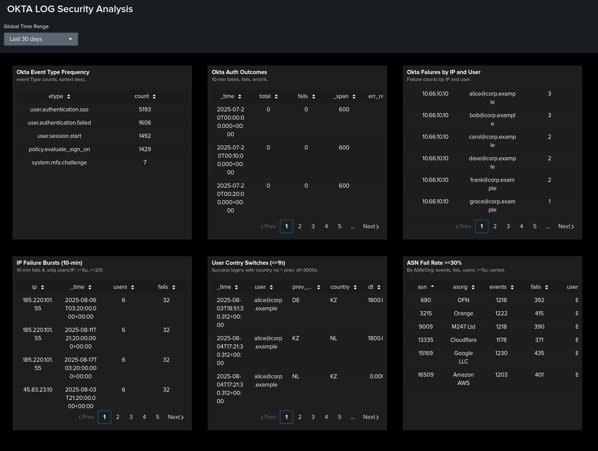

# Splunk Okta Identity Security Analysis

Analytical identity security case: detect error spikes, password spraying, impossible travel, and hostile networks. Built with six focused SPL searches and a dashboard. Based on a full evidence report with screenshots.

---

## Demo

- **Dashboard (import file):** [Dashboard_OKTA](./Dashboard_OKTA.png)
- 
- **Full report (DOCX):** [OKTA_Logs_report.docx](./OKTA_Logs_report.docx) — step-by-step searches, screenshots, observations, and conclusions

---

## Data

- **Source:** Okta identity/authentication events - Splunk  
- **Sourcetype:** `sourcetype=okta_identlty_logs`  
- **Key fields:** `actor.alternateId` (user), `client.ipAddress` (IP), `outcome.result` (SUCCESS/FAILURE), `client.geographicalContext.country` (country), `securityContext.asNumber/asOrg` (ASN/provider)  
- **Parsing:** JSON via `spath`

---

## Performed Checks and Conclusions

### 1) Event Type Distribution
- **Purpose:** establish the baseline by event types.  
- **Finding:** `user.authentication.sso` dominates; notable share of `user.authentication.failed`.  
- **Recommendation:** lock the baseline and watch deviations; handle noisy sources via allow/deny.

### 2) Error Rate Over Time
- **Purpose:** trend of failures vs total over time.  
- **Finding:** short error-rate spikes aligning with attack windows or changes.  
- **Recommendation:** SLO/alert on error-rate growth; correlate with releases/incidents.

### 3) Failure Sources by IP and User
- **Purpose:** prioritize pairs `IP ↔ user`.  
- **Finding:** single IPs hit multiple accounts; some noisy service accounts.  
- **Recommendation:** rate-limit/lockout, block repeat IPs, audit service accounts.

### 4) Brute-Force / Password Spraying (10-minute windows)
- **Purpose:** detect one IP hitting many users with high FAIL volume.  
- **Finding:** bursts with `dc(user) ≥ 5` and `fails ≥ 20 / 10m` indicate spraying.  
- **Recommendation:** template alerts, block/throttle sources, enforce MFA.

### 5) Geographical Anomalies (Impossible Travel)
- **Purpose:** successful logins with country changes in < 60 minutes.  
- **Finding:** sequences like DE→KZ→NL for the same user.  
- **Recommendation:** kill sessions, check endpoints, tighten conditional access.

### 6) High-Risk ASNs (Fail-rate × User Impact)
- **Purpose:** providers/ASNs with high FAIL share and broad user impact.  
- **Finding:** hosting/proxy ASNs with `fail_rate ≥ 30%` and `users ≥ 5`.  
- **Recommendation:** ASN-based deny/limit lists; stricter geo/ASN policies.

---

## Analysis
- Baseline by types and errors established; anomalous windows isolated.  
- Spraying and impossible-travel patterns identified; “hostile” ASNs highlighted.  
- Ready to convert into SOC correlation rules and alerts.

## Conclusion
A repeatable Okta threat-hunting workflow in Splunk. Six targeted searches plus a dashboard provide fast triage, clear alert thresholds, and actionable remediation. Full steps, screenshots, and findings are in **OKTA_Logs_report.docx**; the importable dashboard is **Dashboard_OKTA.png**.
